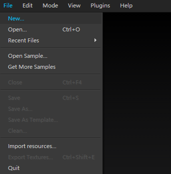
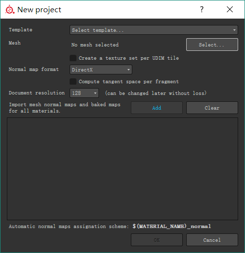
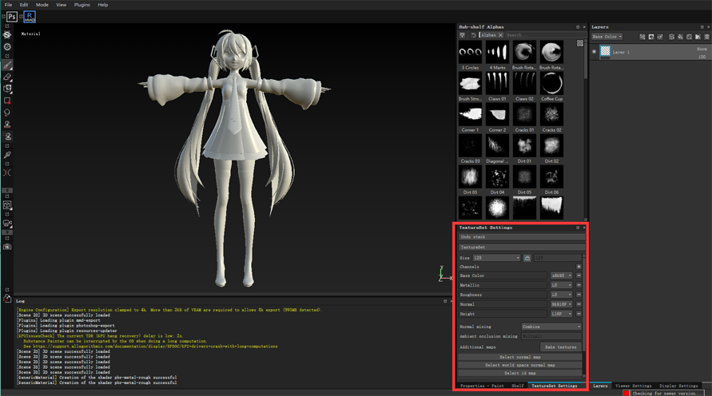
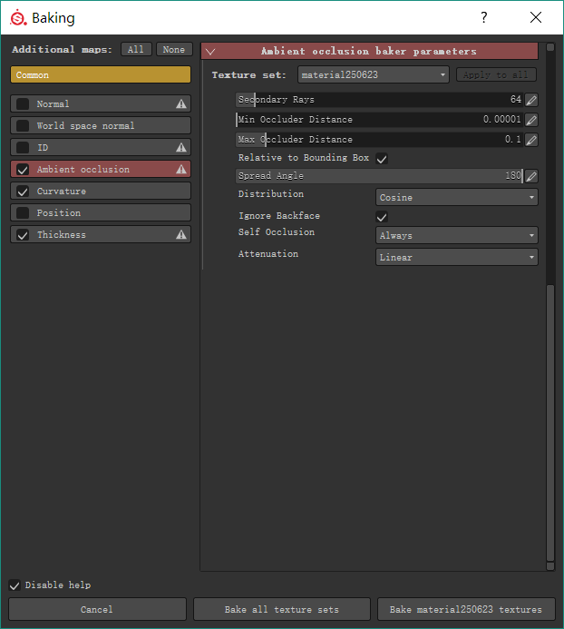
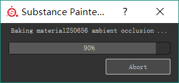
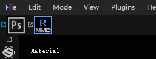
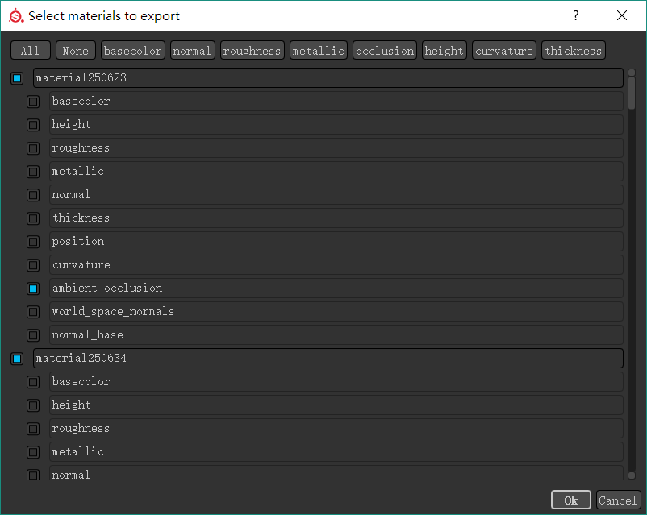

MMD-Export
========
### Ray-MMD for Substance Painter 2.x ###
This plush exports your [Substance Painter](https://www.allegorithmic.com/products/substance-painter) project as Ray-MMD material assert.

Install:
========
* Download a zip archive from the github page
* Un-zip the archive
* Copy the mmd-export folder to Substance Painter's plugin folder
  * OSX: `/Users/yourlogin/Documents/Substance Painter 2/plugins`
  * Win: `C:/Users/UserName/Documents/Substance Painter 2/plugins`

Requirements:
========
* Substance Painter 2.x (Only tested on 2.6.1)
* Python 2.7

Usage:
========
1. Click Menu -> File -> New Project

   

2. Click a 'Select' Button in 'New Project' dialog and choose select a model

   

3. Find & Click a 'bake textures' Button from 'TexturesSet Settings' box

   

4. Setting parameters and click a 'Bake all textures sets' button

   

5. Wait for a moment

   

5. Once this Baking progress is done, click the Export button in the toolbar.

   

6. Choose the textures that you want to export them, then click a Ok button

   

7. It will output some textures and fx materials and you can get these files from "C:\Users\UserName\Documents\Substance Painter 2\export\MMD"

Contact :
------------

* Reach me via Twitter: [@Rui](https://twitter.com/Rui_cg).

[License (MIT)](https://raw.githubusercontent.com/ray-cast/ray-mmd/developing/LICENSE.txt)
-------------------------------------------------------------------------------
    Copyright (C) 2016-2017 Ray-MMD Developers. All rights reserved.

    https://github.com/ray-cast/ray-mmd

    Permission is hereby granted, free of charge, to any person obtaining a
    copy of this software and associated documentation files (the "Software"),
    to deal in the Software without restriction, including without limitation
    the rights to use, copy, modify, merge, publish, distribute, sublicense,
    and/or sell copies of the Software, and to permit persons to whom the
    Software is furnished to do so, subject to the following conditions:

    The above copyright notice and this permission notice shall be included
    in all copies or substantial portions of the Software.

    THE SOFTWARE IS PROVIDED "AS IS", WITHOUT WARRANTY OF ANY KIND, EXPRESS
    OR IMPLIED, INCLUDING BUT NOT LIMITED TO THE WARRANTIES OF MERCHANTABILITY,
    FITNESS FOR A PARTICULAR PURPOSE AND NONINFRINGEMENT.  IN NO EVENT SHALL
    BRIAN PAUL BE LIABLE FOR ANY CLAIM, DAMAGES OR OTHER LIABILITY, WHETHER IN
    AN ACTION OF CONTRACT, TORT OR OTHERWISE, ARISING FROM, OUT OF OR IN
    CONNECTION WITH THE SOFTWARE OR THE USE OR OTHER DEALINGS IN THE SOFTWARE.